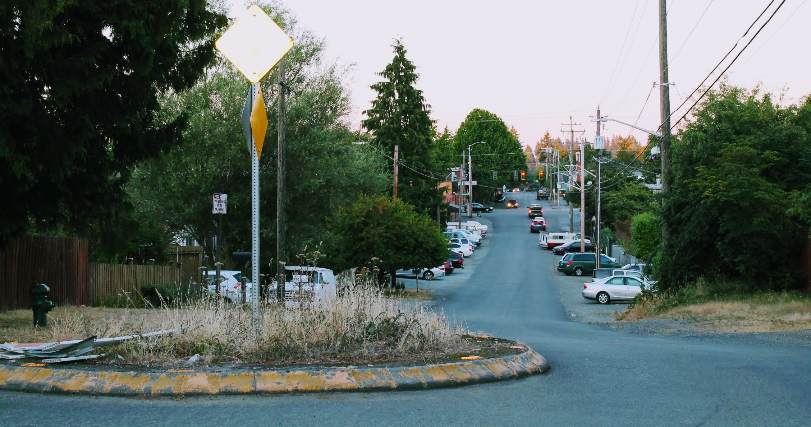
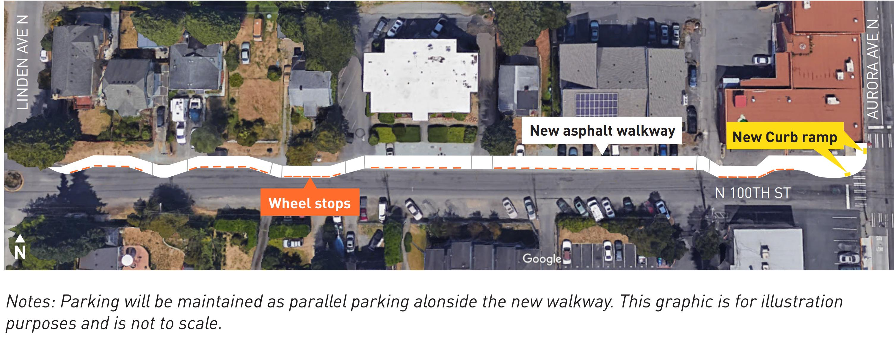
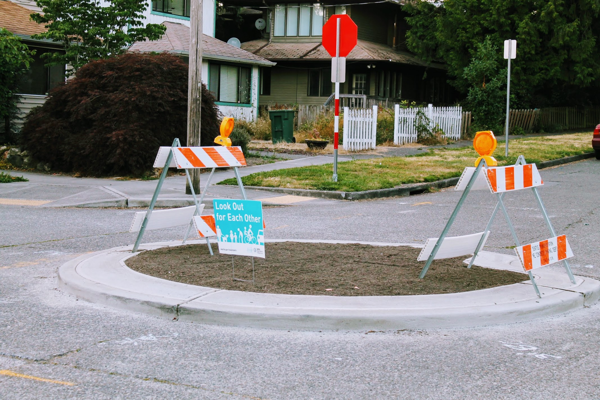

Title: North Seattle Greenway Construction
Date: 2018-07-22 23:00
Author: timothycrosley
Category: Construction
Tags: General, Construction, Pedestrian, Northgate, Greenwood, Crown Hill
slug: north-seattle-greenway-2018
og_image: images/2018_greenway/banner.jpg

A friend of the blog wrote in to let us know the construction of the North Seattle Neighborhood Greenway project down 100th Ave N is set to begin as soon as tomorrow.
The project aims to connect Crown Hill, Greenwood, and Licton Springs both to each other and to the upcoming pedestrian bridge that will provide direct access to the Northgate light rail station. While the entire project, which will stretch around 2 miles, is a welcome addition - of particular interest to those in the Licton Springs area are a [new sidewalk from Linden Ave N to Aurora Ave N](https://www.seattle.gov/Documents/Departments/SDOT/Greenways/N100thStFactsheet.pdf) and sidewalk improvements being made between Aurora Ave N and Stone Ave N.

When the work is complete, the hope is that it will be possible to safely walk or ride a bicycle all the way from Crown Hill to the new light rail station, with sidewalk at a  minimum from Linden Ave N eastward. You can find more information about the project on [SDOT's overview page](https://www.seattle.gov/transportation/projects-and-programs/programs/greenways-program/north-seattle). The project should take around 6 months to complete with individual neighbors being directly contacted as construction work that impacts them is underway.

Meanwhile, the traffic circle on Wallingford Ave N and N 97th [we wrote about earlier this year](https://lovelicton.com/street_improvements_preview_2018.html) has now been completed and is just awaiting greenery.

We look forward to a safer and more walkable North Seattle!
