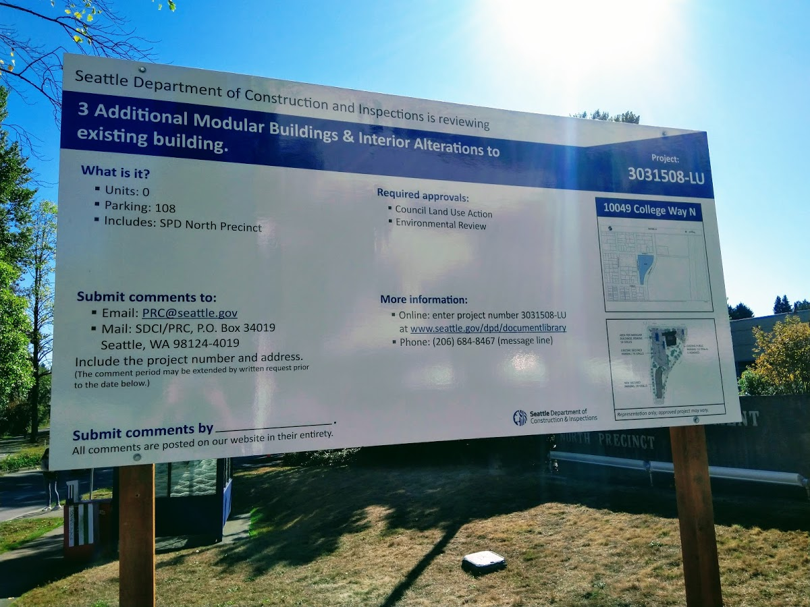

Title: North Seattle Precinct set to expand Licton Springs footprint
Date: 2018-10-29 23:00
Author: timothycrosley
Category: Construction
Tags: General, Construction, Police, North Seattle
slug: north-precinct-set-to-grow
og_image: images/precinct/front.jpg

Where College Way N and Meridian Ave N meet in Licton Springs there is a small police station. That station is responsible for serving all of North Seattle. From Ballard to UDistrict, Fremont to Haller Lake, all of them are served by the North Precinct. This easily makes it the station that serves both the largest land area and population.

<iframe src="https://www.google.com/maps/d/embed?mid=1pq76mrRNksF3pvM-Z0xgeFuBW-UuPdPn" width="640" height="480"></iframe>

Naturally, this has led for many calls to split the precinct, or most recently, replace it with a new much larger location (on Aurora). However, thus far, there hasn't been political alignment to turn these calls into reality. The most recent of which was stopped by a counter campaign to ["Block the Bunker"](http://council.seattle.gov/2016/09/16/sawant-block-the-bunker-activists-to-celebrate-victory-on-north-precinct-call-to-use-funds-for-housing/), primarily driven from those who live in areas that aren't in the area served by the precinct they wish to block.

Now, if you walk by the precinct, you will be greeted by many land use signs. The North Precinct plans to increase its footprint at its current location.

Where grass and greenery used to be, [the precinct plans to pave additional parking and add portables](https://www.seattle.gov/Documents/Departments/NorthPrecinctStation/NorthPrecinctFlyer.pdf).
The plan isn't meant to be a permanent solution, but the hope is it will enable the precinct to keep up with the next 5-7 years of growth.
And while there is concern by many over the loss of greenspace as [illustrated in the public comments](http://web6.seattle.gov/dpd/edms/) (record # 3031508-LU), with no other agreed on options,
combined with an increasing call for greater public safety and police presence, it seems increasingly likely that we will see the start of an expanded precinct in Licton Springs come this time next year.
