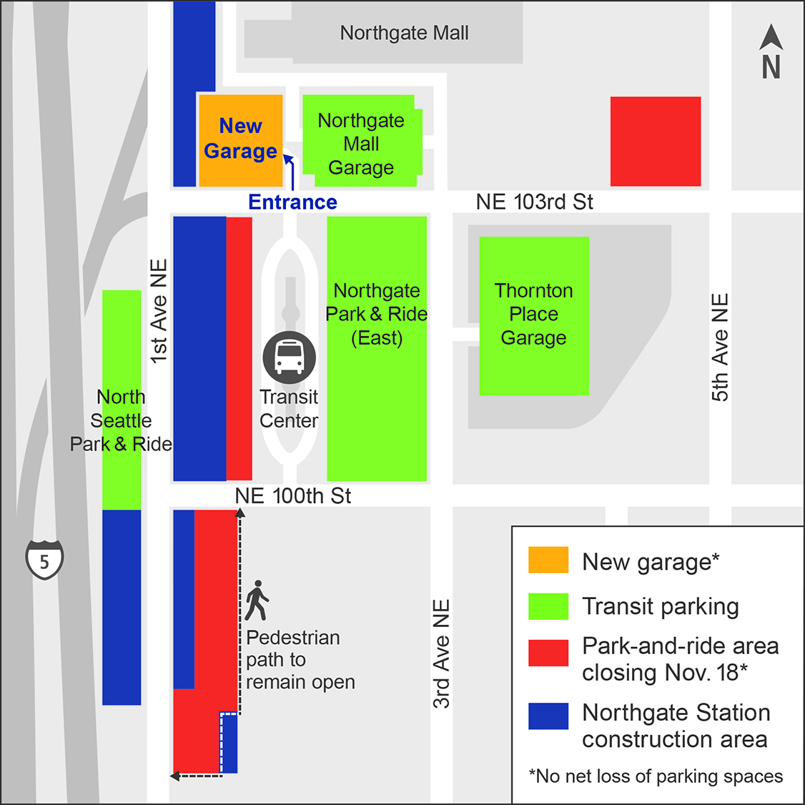

Title: Changes coming soon to Northgate Transit Center
Date: 2018-11-08 15:00
Author: timothycrosley
Category: Information
Tags: General, Transportation, Northgate, Transit, Parking
slug: northgate-transit-changes-2018
og_image: images/northgate/overview.JPG

Well ahead of the light rail opening, many changes are coming to Northgate Transit Center, some over the next few weeks, and others early next year.

Back in September, we saw our first positive change as the [41 bus received more frequent service](https://www.kingcounty.gov/elected/executive/constantine/news/release/2018/July/25-metro-service-amazon-seattle.aspx). However, as Seattle prepares for the [period of maximum constraint](http://sdotblog.seattle.gov/2018/09/07/seattles-transportation-new-normal-is-just-around-the-corner/) early next year,
you can expect even more changes to come to our transit station.

The first major change coming is the opening of the new parking garage to the north of the station, coinciding with the close of the 2 west side lots:

The new parking garage will contain 450 parking spots, more than making up for the closed lots, [but some of the new spots will be reserved for paying customers](https://komonews.com/news/local/want-to-park-at-the-northgate-park-and-ride-it-might-cost-you-125-per-month).
More information about the parking changes can be found [on Sound Transit's overview](https://m.soundtransit.org/northgatestation/northgate-transit-center-park-and-ride).
These changes will take effect Monday, November 19th.

Then, come March of next year, [big changes are planned for our fastest connection to Bellevue - the 555](https://m.soundtransit.org/Projects-and-Plans/service-planning/service-implementation-plan). The route will be updated to bypass Montlake and operate only between Northgate and Bellevue, no longer serving Eastgate or Issaquah.
This should result in much quicker and dependable transit times for those commuting between Licton Springs and Downtown Bellevue.

Finally, with land usage signs now visible around the North Seattle College's Campus, construction on the pedestrian bridge from Licton Springs to the transit center has passed its biggest hurdles and is set to begin construction next year.

Here's to hoping all the transit changes lead to a quicker more dependable commute!
