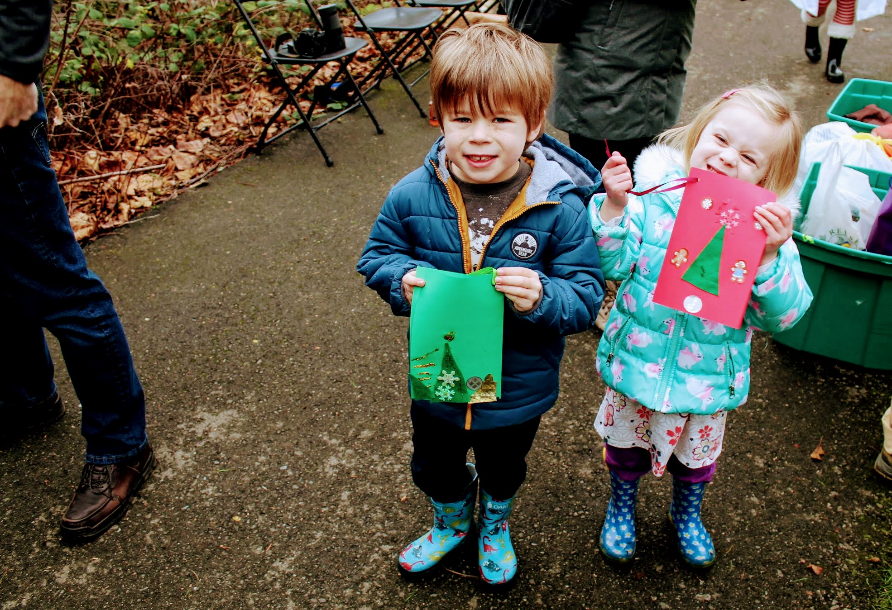
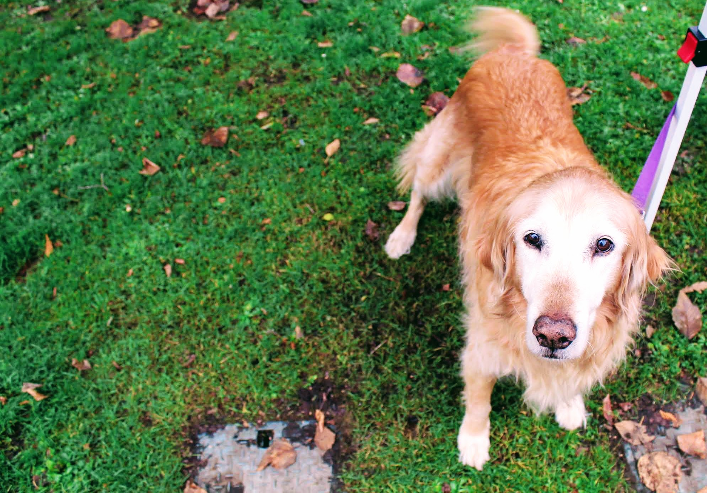
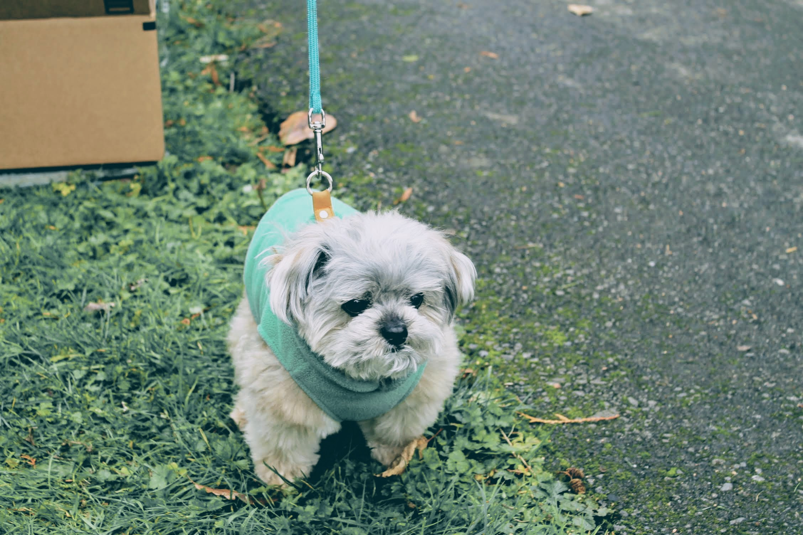
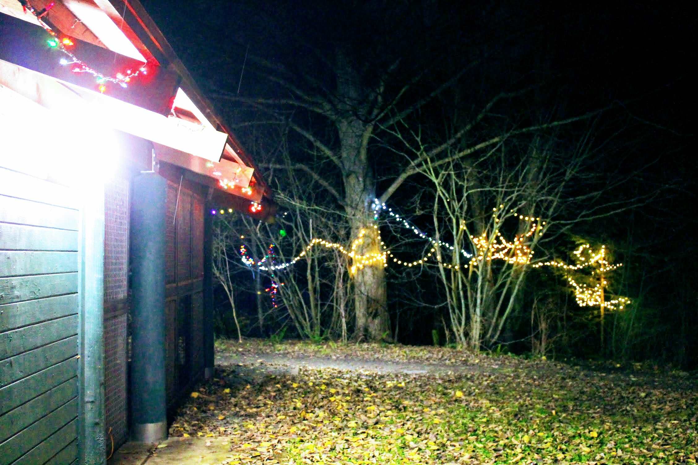
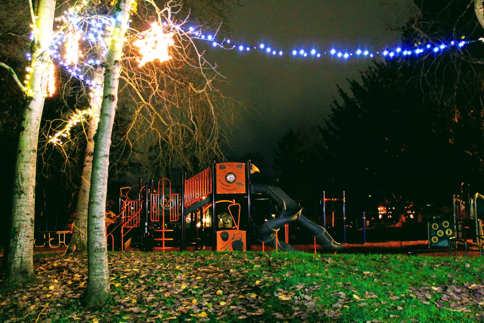

Title: Holiday Events Brighten Licton Springs
Date: 2018-12-16 21:00
Author: timothycrosley
Category: Events
Tags: General, Community Meeting, Event, Outdoors, Parks, Music, Crafts
slug: holiday_event_cheer_2018
og_image: images/events/2018/december/mineral_springs_crowd.jpg

Thank you to everyone that came out Saturday and helped make Licton Spring's holiday a little brighter! Whether you helped put lights up at Licton Springs park or made crafts and enjoyed music with us at Mineral Springs Park, you are part of what makes this neighborhood such a great place to call home. Here are some of our favorite memories from this year's holiday events:

*Neighbors get up early to string lights up at Licton Springs Park*

*Neighbors and friends gather at Mineral Springs park to enjoy hot cocoa, Jones Soda, and snacks while working on crafts and enjoying local musicians*

*Seattle Sugarplum Elves put on a great performance, drawing in the crowd.*

<iframe width="560" height="315" src="https://www.youtube.com/embed/pXHwu5DEvQs" frameborder="0" allow="accelerometer; autoplay; encrypted-media; gyroscope; picture-in-picture" allowfullscreen></iframe>

*Randy from the Parks Department, who has done so much to enable Mineral Springs Park improvements, gets pulled into the Seattle Sugar Plum Elves' performance.*

*Musician Hugh Sutton plays a variety of songs that engage the kids, including Star Wars tracks!*

*Beyond hot cocoa and cookies, attendees enjoyed a wide variety of soda donated by Jones Soda.*

*Raffle tickets are handed out to everyone that donated clothing or canned goods for Aurora Commons.*

*Kids put together custom holiday cards at the craft table.*

*Neighborhood dogs said hello during the festivities.*

*All of this the day after a large tree fell down in the park due to a wind storm!*

*Finally, we ended the night with a beautifully lit Licton Springs Park.*

Hope you a have a great holiday season!
